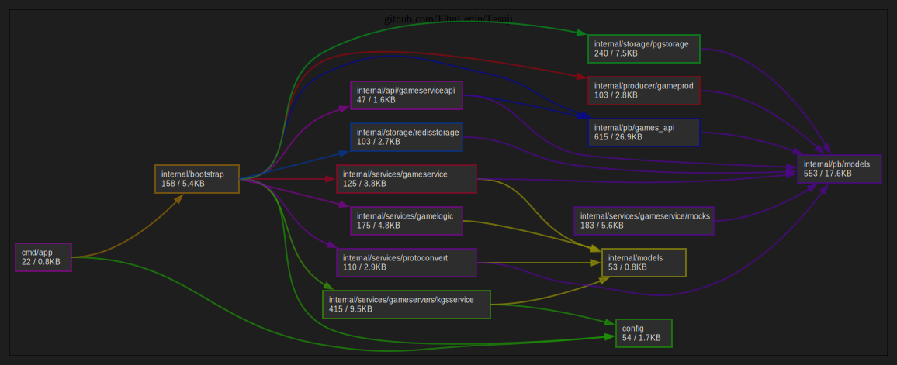

# Tesuji — просмотр партий по игре Го в реальном времени

[](https://github.com/J0hnLenin/Tesuji/actions/workflows/coverage.yml)
[](https://coveralls.io/github/J0hnLenin/Tesuji)
[](https://github.com/J0hnLenin/Tesuji/actions/workflows/lint.yml)  

[](https://go.dev/)
[](https://vuejs.org/)
[](https://www.postgresql.org/)
[](https://redis.io/)
[](https://kafka.apache.org/)
[](https://docs.docker.com/compose/)
[](https://github.com/features/actions)

---

## 📖 Описание

**Tesuji** — это веб-приложение для просмотра партий по игре Го в реальном времени. На данный момент партии импортируются с сервера **KGS** (одна из крупнейших онлайн-платформ для игры Го), с помощью reverse-engineering их протоколов. В будущем планируется добавить поддержку других серверов, таких как **FoxWeiqi** и **OGS**.

Проект построен по принципам микросервисной архитектуры: бекенд и фронтенд разделены и взаимодействуют через REST API. Для обработки потоковых данных используется **Kafka**, а для кеширования — **Redis**, что позволяет эффективно работать с большим количеством игр и пользователей.

---

## 📂 Структура проекта

```
Tesuji/
├── backend/                # Go-сервер
│   ├── internal/
│   │   ├── gamelogic/      # Логика игры
│   │   ├── gameservice/    # API и бизнес-логика
│   │   ├── kgsclient/     # Клиент для KGS
│   │   ├── protoconvert/   # Конвертация protobuf
│   │   └── storage/        # Работа с БД (PostgreSQL, Redis)
│   ├── cmd/                # Точка входа
│   └── go.mod
├── frontend/               # Vue-приложение
│   ├── src/
│   ├── public/
│   └── package.json
├── docker-compose.yml      # Оркестрация всех сервисов
├── .github/workflows/      # GitHub Actions CI/CD
└── README.md
```

## 🏗 Архитектура

### Cхема


### Граф зависимостей



### Компоненты

1.  **Frontend (Vue 3)** — SPA (Single Page Application) для отображения списка игр и просмотра конкретных партий. Использует Vite для сборки и CSS для стилизации.

2.  **Backend (Golang)** — основной который содержит:
    - **GameService** — модуль управления бизнес-логикой.
    - **KGS Client** — модуль для подключения к серверу KGS, получения данных в реальном времени (reverse-engineering протоколов).
    - **Protobuf Converter** — конвертация данных из формата KGS во внутренние структуры.
    - **Storage** — взаимодействие с PostgreSQL и Redis.

3.  **Базы данных и брокеры**:
    - **PostgreSQL** — основное хранилище данных об играх, пользователях, истории.
    - **Redis** — кеш-слой для ускорения ответов API.
    - **Kafka** — шина событий для обмена данными между микросервисами (в перспективе).

4.  **Инфраструктура**:
    - **Docker & Docker Compose** — контейнеризация всех компонентов, простой запуск одной командой.
    - **GitHub Actions** — автоматическая сборка, тестирование и деплой (CI/CD).

---

## 🚀 Установка и запуск

### Требования
- Git
- Docker & Docker Compose

### Шаги

1.  **Клонируйте репозиторий:**
```bash
git clone https://github.com/J0hnLenin/Tesuji.git
cd ./Tesuji
```

2. **Настройка окружения (опционально):**  
При необходимости отредактируйте переменные в файле .env (секреты, порты, строки подключения к БД). По умолчанию всё настроено для локального запуска.

3. **Запуск проекта:**
```bash
docker compose up -d
```

**После запуска будут доступны:**

- Frontend: http://localhost:4173

- Backend API: http://localhost:8080

- gRPC (бекенд): http://localhost:50051

---

## 📡 API Эндпоинты

### Backend (REST API, порт 8080)

|Метод|URL|Описание|
|-----|---|--------|
|GET|/api/v1/games|Получить список игр с пагинацией. Параметры: ?page=1&limit=10|
|GET|/api/v1/games/{id}|Получить информацию о конкретной игре по её ID|

### Frontend (порт 4173)

|Метод|URL|Описание|
|-----|---|--------|
|GET|/games|Список игр|
|GET|/games/{id}|Просмотра конкретной игры|

